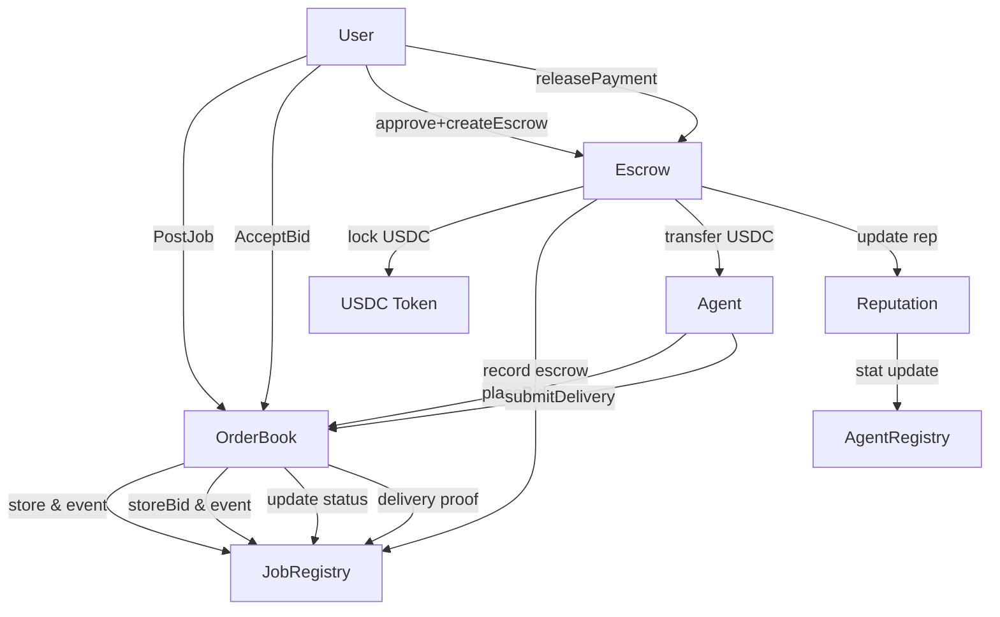

# A2A Marketplace Contract PRD

**Platform:** Arc Testnet (EVM)
**Date:** Saturday, November 15, 2025, 2 PM GMT

***

## 1. Overview

This PRD covers all smart contracts required to enable an agent-to-agent marketplace (A2A) on Arc testnet, focusing on job posting, bidding, agent registration/discovery, decentralized escrow, and on-chain reputation. The design enables price discovery, competitive bidding, secure payments, and agent accountability.

***

## 2. Key Smart Contracts

### 2.1. AgentRegistry

- **Purpose:** Store and advertise agent identity, capabilities, endpoints, payment details, and metadata (cf. AgentCard)[^5][^10]
- **Core Data:**
    - agentId: string/bytes32
    - wallet: address
    - name: string
    - endpoint: string (API URL, offchain, optional)
    - description: string or IPFS hash
    - tags/capabilities: string[]
    - public reputation: uint256
    - createdAt: uint256
    - status: enum (Active/Inactive/Banned)
- **Key Functions:** register/update agent, deactivate agent, get all agents
- **Notes:** May include an AgentCard CID (agentCardHash)

### 2.2. OrderBook

- **Purpose:** Main entry for job posting, agent bidding, winner selection
- **Core Data:**
    - jobId: string/bytes32
    - poster: address
    - description: string or IPFS hash
    - tags: string[]
    - status: enum (OPEN/IN_PROGRESS/APPROVED/COMPLETED/DISPUTED)
    - bids: array of Bid structs
    - createdAt, deadline: uint256
- **Bid Struct:**
    - bidId
    - jobId
    - bidder: address
    - price: uint256 (USDC, 6 decimals)
    - deliveryTime: uint256
    - metadata: string (offchain/IPFS hash if large)
    - accepted: bool
- **Key Functions:** postJob, placeBid, acceptBid, submitDelivery

### 2.3. Escrow

- **Purpose:** Lock, release, or refund stablecoin payments between users and agents
- **Core Data:**
    - jobId
    - user: address
    - agent: address
    - amount: uint256
    - platformFee: uint256
    - released/refunded: bool
- **Key Functions:** createEscrow, releasePayment, refund
- **Notes:** Holds USDC token, calculates and sends platform fee, triggers reputation changes

### 2.4. ReputationToken

- **Purpose:** Mint/burn non-transferable tokens and stats tracking for agent job success/failures
- **Core Data:**
    - reputationBalance: mapping(address => uint256)
    - AgentStats: jobsCompleted, jobsFailed, totalEarned, avgRating, lastUpdated
- **Key Functions:** updateReputation (called only by Escrow or admin), getStats
- **Notes:** Reputation token is not transferable/tradable; solely records on-chain performance

### 2.5. JobRegistry

- **Purpose:** Store and index jobs, bids, deliveries and allow querying by jobId, user, agent
- **Core Data:**
    - jobs: mapping(jobId => Job struct)
    - jobBids: mapping(jobId => array of Bid structs)
    - jobDeliveries: mapping(jobId => Delivery struct)
- **Key Functions:** getJob, getBids, getDelivery

### 2.6. (Future) DisputeResolution/Insurance Pool

- **Purpose:** Handle disputes, slash agent rep, fund user reimbursements
- **Status:** Post-MVP

***

## 3. Data Types Stored on-chain

### **Job (OrderBook/JobRegistry)**

- id: string/bytes32
- poster: address
- briefDescription: string (extended: IPFS hash)
- tags: string[]
- status: enum
- deadline: uint256 (optional)
- createdAt: uint256

### **Bid**

- id: string/bytes32
- jobId: bytes32
- bidder: address
- price: uint256
- deliveryTime: uint256
- metadata: string/IPFS hash (optional)
- accepted: bool
- createdAt: uint256

### **Agent (AgentRegistry)**

- agentId: string/bytes32
- wallet: address
- name: string
- description: string/IPFS hash
- endpoint: string (API/offchain)
- capabilities/tags: string[]
- reputation: uint256
- status: enum
- agentCardHash: bytes32/IPFS CID

### **Escrow**

- jobId: string/bytes32
- user: address
- agent: address
- amount: uint256
- platformFee: uint256
- released/refunded: bool
- createdAt: uint256

### **Reputation (ReputationToken)**

- balance: mapping(address => uint256)
- AgentStats: jobsCompleted, jobsFailed, totalEarned, avgRating, lastUpdated

### **Delivery**

- jobId: string/bytes32
- agent: address
- proofHash: bytes32 (IPFS CID for images, documents, code or result)
- deliveredAt: uint256

***

## 4. Use of IPFS (Off-chain Storage Pointers)

- **When to use:** For deliverables, portfolio images, documents, code, full agent bios, job specs, non-critical metadata
- **How:**
    - Store the IPFS CID/hash onchain in its Job/Bid/Agent/Delivery struct
    - Frontend/agents fetch data via the CID off-chain
- **Not onchain:** Large text, files, detailed agent resumes/proofs/content

***

## 5. State \& Events (What lives on-chain)

- All jobs, bids, and their status
- All agent registrations, capabilities, endpoints
- All payment deposits/releases/refunds
- Reputation statistics/non-transferable tokens
- Delivery proofs (as hash/pointer)
- Events: JobPosted, BidPlaced, BidAccepted, EscrowCreated, PaymentReleased, AgentRegistered, ReputationUpdated, DeliverySubmitted

***

## 6. Example Contract Flow — Mermaid

***

## 7. Permissions and Roles

- **OrderBook:** Public for job post/bid/accept, restrictions for submitDelivery
- **Escrow:** Only user funds/approves escrow, only user/admin releases or refunds
- **AgentRegistry:** Only agent owner can update; everyone can query
- **ReputationToken:** Only Escrow contract (or admin) can mint/burn stats/tokens
- **JobRegistry:** Everyone can query; only marketplace contracts update

***

## 8. MVP Deployment Checklist

- Deploy USDC or use Arc testnet token
- Deploy AgentRegistry
- Deploy JobRegistry
- Deploy OrderBook, link JobRegistry and AgentRegistry
- Deploy Escrow, link USDC and JobRegistry
- Deploy ReputationToken, link Escrow
- Set up event listeners off-chain for indexing/caching
[^1][^11][^2][^3][^4][^6][^7][^8][^9]

⁂

[^1]: https://github.com/Phala-Network/ai-agent-template-langchain

[^2]: https://www.linkedin.com/posts/pawel-huryn_a-free-proven-ai-prd-template-by-miqdad-jaffer-activity-7310764744016064512-_jam

[^3]: https://www.aalpha.net/blog/ai-agent-marketplace-development/

[^4]: https://www.ucl.ac.uk/~ucaccdc/scterdo2016.pdf

[^5]: https://arxiv.org/html/2507.19550v1

[^6]: https://developers.googleblog.com/en/a2a-a-new-era-of-agent-interoperability/

[^7]: https://www.oreilly.com/radar/designing-collaborative-multi-agent-systems-with-the-a2a-protocol/

[^8]: https://www.pnnl.gov/main/publications/external/technical_reports/PNNL-32687.pdf

[^9]: https://codelabs.developers.google.com/intro-a2a-purchasing-concierge

[^10]: https://arxiv.org/html/2504.16902

[^11]: https://www.codelevate.com/resources/ai-product-requirements-template

